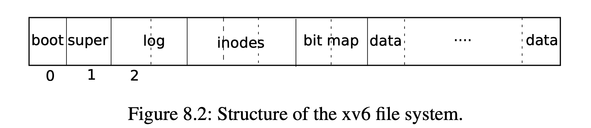
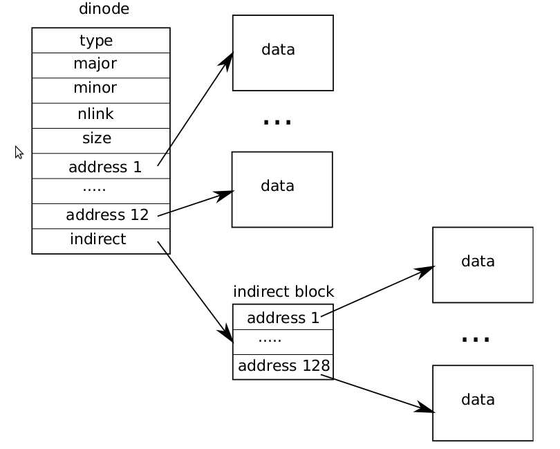

# CSC 4730 Fall 2023 Project 8

In this project you will be given one or more xv6 file systems which may
or may not have been corrupted. Your job is to write an application
which reads a file system image and parses the file system contained
therein to locate the first instance of corruption in the image and
describe it to the console.

You are *not* responsible for repairing the corruption you find.

## Objectives

As a result of implementing this project, you will have:

* Mastered the understanding of the xv6 file system and therefore, many
  early file system designs.

* Taken a picture and include files and turned them into an important
  program that checks the validity of critical data structures.

* Demonstrated an understanding of hierarchical file systems.

* Demonstrated an understanding of hierarchical data structures used in
  managing the resources of a given file.

* Learned to parse binary files either directly from disk or from a
  memory region (which of these are dependent upon your design choices
  both of which are equally acceptable).

## Deadlines

You and your assigned partner have 7 days to complete this assignment
plus one grace day. If you have not turned anything in by 11:59 PM on
the eighth day, you will win a grade of zero. Therefore, to receive
partial credit, hand in something before the project expires!

## Overview

You will write a simplified version of a system program that is vital to
the correct and safe operation of any Unix-like system. In fact, it is
likely all operating systems come with a program like the one you are
implementing. This program typically has a name like `fsck` for *f*ile
*s*ystem *c*hec*k*. It is mildly amusing that `fsck` is yet another
example of the key stroke economy of the early Unix inventors.

Should a machine or storage device fail in the midst of updating a file
system, it is possible for the complex data structure that is the file
system may become corrupted. If left undetected (and not repaired)
**very bad things can occur.**

If not implemented correctly, **people can die.**

"Seriously Professor? You're on about this again?"

"Yes. Definitely"

"Really, how?"

"A machine crash causes an inconsistent file system. The configuration
file controlling the treatment parameters for a cancer radiation machine
becomes scrambled. The error remains undetected. The next several
patients going through the machine die a week later, meaning for up to a
week more patients will get lethal doses of radiation. Please, young
student, how would **you** explain this to the grieving families?"

## Overall layout of the file system

The following image from chapter 8 of the xv6 book (link given in
syllabus) shows the overall layout of our file system.



Every block is 512 bytes (```BSIZE```).

The Super Block is in block 1. It tells you how many inodes are in the
file system. From this you can compute the number of blocks devoted to
the inode array beginning at block 2.

After the inode array, the bit map blocks are found. In the file systems
you will be given, there exists only **one** block in this part of the
file system. The bit map contains a bit for every block. If a block is
available, its bit will be zero.

After the bit map block comes the data blocks.

You will ignore the log blocks.

## fs.h

Nearly everything you need to known about the file system is contained
here:

[fs.h](./fs.h)

There are a number of handy C macros in this file. For example,
```IPB``` will compute the number of blocks that some specified number
of inodes will consume.

## The super block and the first thing you should do

A superblock resides in a *known place* and describes the file system.

The first thing you should write is code to check the size of the file
system file against the `size` in the super block. Ensure you can make
sense of the `size` field before you move on.

*You must print out the values in the super block in your output.*

For example:

```text
Superblock:
FS size in blocks:     1000
Number of data blocks: 941
Number of inodes:      200
Number of log blocks:  30
Number of BM blocks:   1
Log starting block:    2
Inode starting block:  32
BM starting block:     58
Number of meta blocks: 59
Data blocks start at:  59
Superblock OK
```

## Inodes

The file system's inodes are simplified from those we learned about.

For you, this is a *Good Thing*.



Notice there is only a single layer of indirection possible. Real
hierarchical equivalents of inodes may contain many levels of
indirection.

Ignore ```major``` and ```minor```.

## No free block list

This file system does away with the free block list.

For you, this is a *Good Thing*.

Instead it keeps track of free blocks using a bit map. One bit
corresponds to one block. A 512 byte block contains 4096 bits. Therefore
a single block is needed for the file systems you will be given (as they
contain fewer that 4096 blocks).

## types.h

Self explanatory.

## stat.h

From here you get the definition of `T_DIR` and `T_FILE`.

## Build an in-memory model of the file system

You must build an in-memory model of the file system so that you can
account for every file, block, inode, directory etc. This does *not*
mean you simply read the whole file system file into memory which in
this case you can but remember that file systems exist which are so
large as to make this unreasonable.

## Types of errors

The following types of corruption will be present in one or more of the
file system files you are given.

### Missing block

The bit map says block *n* is allocated but you cannot find it belonging
to  any file or directory.

### Unallocated block

The bit map says block *n* is free but you found it referenced by a
valid inode.

### Multiply allocated block

An allocated block is referenced by more than one inode, or more than
once by the same inode.

### Missing inode

An inode number is found in a valid directory but is not marked as
allocated in the inode array.

### Unused inode

An inode marked valid is not referred to by a directory.

### / problems

These problems relate to /.

* Inode 1 is not allocated.

* Inode 1 is not a directory.

* The root directory does not refer to itself as . and ..

### `.` and `..`

A directory's first two file names are not . and ..

### Directory loops

A directory may not refer to another directory which is an ancestor of
itself other than its parent (i.e. `..`).

### A . or .. inode is not a directory

The inode numbers mapping a . or .. lead to non-directories.

### A non-root directory with . listing inode 1

Inode 1 is the root directory. No other directory can list itself (i.e.
.) as inode 1.

### Directory link counts

The link count in a directory inode is not the number of directories it
contains. Note this is really covered by the next error.

### File link count

The link count of a file is not the number of times the file is referred
to by a directory.

### File size

A file's size in bytes cannot exceed the maximum file size (figure out
what this is).

### A valid directory entry non-printable ASCII

File names with non printable ASCII characters should be flagged.

## Platform and language

All work must be in C and / or C++ designed for Linux and compilable by
```g++ -std=c++11```.

## Usage

Your program must require a `-f` command line option which is to be
followed by the name of a file system image to be checked.

## All error messages

Should be as specific as possible listing block or inode numbers.

## What to Hand In

Execute a `make clean`. Then zip all source code including your
makefile. Test the zip file to ensure you have done this correctly. Hand
in the zip file.

## Partners

* You must use only the partner I assign to you.

* Only 1 person should hand in code. The code should clearly state who
  the partners are in a new text file `partner.txt` in the main
  directory.

* The non-code-submitting partner must submit a text file “partner.txt”
  that states who the partners are.

* **Failure to list partners correctly as described above removes 5
  points from your grade.**
  
  "Stupid Professor, this seems like a stupid and unnecessary
  requirement that I will ignore."
  
  Someday you will join a team. The team may have requirements that seem
  stupid to you. Violation of the requirement can result in a poor
  performance review.
  
  No raise for you.
  
  Or, "They're (i.e. you) just not fitting into our team culture," says
  your supervisor.
  
  No job for you.

## Grading

The class will receive a rubric when grading is complete that describes
errors and penalties.

Both partners get the same grade without exception.
